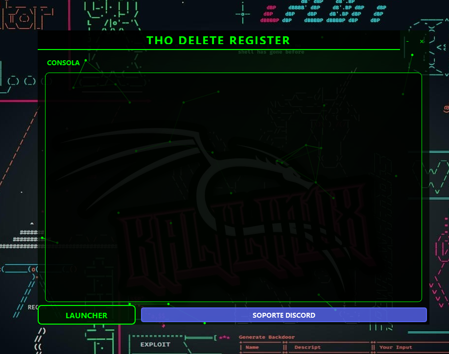

# THO DELETE REGISTER

<div align="center">
  
  
  
  [](https://discord.gg/uPESr5v7yQ)
</div>

## 🚀 Vista General
THO DELETE REGISTER es una herramienta profesional para limpiar registros del sistema y mantener la privacidad del PC. Cuenta con una interfaz gráfica moderna con efectos de red neuronal y un diseño minimalista.

## ✨ Características
- 🧹 Limpieza profunda del registro de Windows
- 🗑️ Eliminación de archivos temporales
- 📜 Limpieza del historial del sistema
- 🔄 Generación de registros falsos para mayor seguridad
- 🎨 Interfaz moderna con animaciones
- 🛡️ Auto-eliminación sin dejar rastros

## 🎥 Video Tutorial
[](https://www.youtube.com/watch?v=VIDEO_ID)

## 🛠️ Instalación

### Prerrequisitos
- Python 3.11 o superior
- Windows 10/11

### Pasos de Instalación
1. Clona el repositorio:
```bash
git clone https://github.com/your-username/tho-delete-register.git
cd tho-delete-register
```

2. Ejecuta el instalador:
```bash
install.bat
```

### Construcción del Ejecutable
Para crear el archivo ejecutable:
```bash
build.bat
```
El ejecutable se generará en la carpeta `dist`.

## 🎮 Uso
1. Ejecuta `panel.py` o el ejecutable generado
2. Haz clic en "LAUNCHER" para iniciar la limpieza
3. El programa se autoeliminará al terminar

## ⚠️ Advertencias
- Ejecutar como administrador para acceso completo
- Crear respaldo del sistema antes de usar
- No interrumpir el proceso de limpieza

## 🤝 Soporte
¿Necesitas ayuda? Únete a nuestro [servidor de Discord](https://discord.gg/uPESr5v7yQ)

## 📝 Licencia
Este proyecto está bajo la Licencia MIT. Ver el archivo [LICENSE](LICENSE) para más detalles.